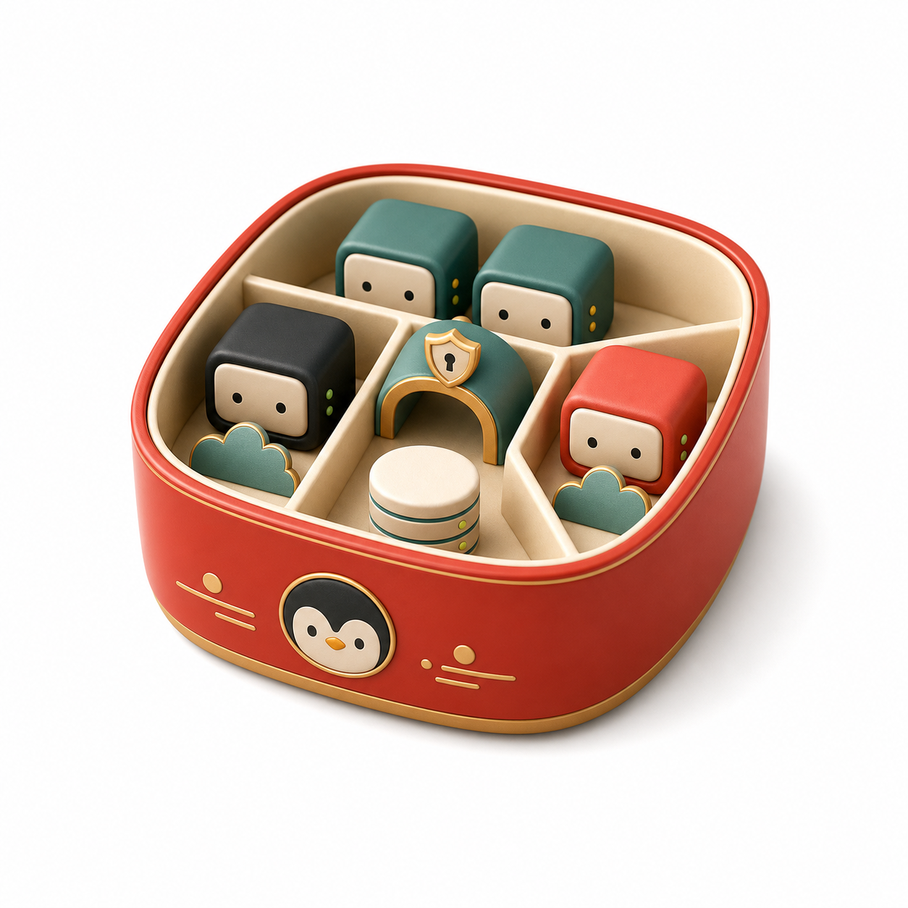

# Bento

Bento is a self-hosted control plane for running PHP apps and Node.js HTTP apps on one Linux host with Docker.
Each app gets its own persistent container, Linux identity, home directory, scheduler, and data bindings. Bento keeps
your intent in SQLite and converges Docker toward it through the Docker Engine API.



```text
browser UI / bento CLI
        │  REST + WebSocket/SSE (loopback only, authenticated)
        ▼
bento serve ── SQLite intent + operation journal + reconciler ── Docker Engine API
        │
        ├─ app-<id>        one per app: s6 → (Nginx + PHP-FPM | your HTTP process) + minicrond, all as the app UID
        ├─ edge (optional) shared Nginx: domains, TLS/ACME, HTTP/3, routes to published apps
        ├─ cloudflared     optional tunnel, may target apps directly
        └─ MySQL / PostgreSQL / Redis on a private internal network
```

The backend is not in the request path. If it stops, apps, the edge, and schedules keep running; only management
and reconciliation pause.

## Highlights

- **One container per app**, built from shared managed images (PHP 7.4–8.5 with local Nginx, Node.js 20–24, Bun,
  Python). Non-root from PID 1, read-only root filesystem, all capabilities dropped, no host ports, no Docker socket.
- **Stable identity.** Every app incarnation has a random ID and a never-reused UID/GID. Removing an app keeps its home
  and databases until you explicitly prune them.
- **Explicit lifecycle.** Create → start (waits for real readiness) → publish (managed edge only). Stop survives backend
  and host restarts. Deleted containers are recreated only when the app's durable data is intact.
- **Ingress your way.** Bento's edge, Cloudflare Tunnel straight to `http://app-<id>:<port>`, or your own proxy on the
  app network. Only edge routes are Bento-controlled, and the UI says so.
- **Per-app scheduler.** [minicrond](https://github.com/khanhicetea/minicrond) runs inside each app. Its UI is served
  through an authenticated same-origin gateway and a UID-matched relay, never with a token handed to the browser.
- **Data.** Add-only MySQL/PostgreSQL/SQLite bindings, per-app Redis ACL users, logical backups with atomic
  publication and retention, exact-confirmed restores, and consistent stack export/import.

## Install

Requirements: Linux amd64 or arm64, Docker Engine with API ≥ 1.44, root (the backend owns app homes and runs the
scheduler relay).

```bash
install -m 0755 bento-linux-amd64 /usr/local/bin/bento
bento --stack /srv/bento/prod init --name prod --mysql 8.4   # or --postgres 17
install -m 0644 deploy/systemd/bento@.service /etc/systemd/system/
systemctl enable --now bento@prod
bento --stack /srv/bento/prod auth set-password
ssh -L 7780:127.0.0.1:7780 your-host    # then open http://127.0.0.1:7780
```

`BENTO_STACK_ROOT` can replace `--stack`. There is no global "current stack". Directories that are not Bento stacks
are refused and left untouched.

## First app

```bash
export BENTO_STACK_ROOT=/srv/bento/prod
cat > shop.json <<'EOF'
{"slug":"shop","runtime":{"kind":"php-fpm","php":{"version":"8.4","documentRoot":"public","routing":"front-controller","pool":"small","uploadLimitMb":64}},
 "domains":["shop.example.com"],"route":{"tls":"acme","redirectHttps":true,"accessLog":false},
 "bindings":[{"engine":"mysql","service":"mysql84"}]}
EOF
bento app create --json shop.json      # provisioned, stopped, unpublished
bento app shell shop                    # starts in /home/shop/app; run: git clone <repository> .
bento app start shop                    # waits for FPM, local Nginx, scheduler, and HTTP readiness
echo '{"enabled":true,"bind":"0.0.0.0","httpPort":80,"httpsPort":443,"http3":false,"acmeEmail":"you@example.com","acmeUrl":""}' \
  | bento edge set --json -
bento app publish shop
```

Credentials reach the app as environment variables (`DB_*`, `BENTO_DB_<n>_*`, `REDIS_*`), never through the API.

## Development

```bash
mise install                               # pinned toolchains
bun install --frozen-lockfile
bun run fmt:check && bun run lint && bun run check && bun run web:build
sudo make -C apps/backend ci               # gofmt, vet, race tests, tygo drift check, build
sudo make -C apps/backend test-integration # real Docker, disposable stack roots
make -C apps/backend release               # embeds the UI; static linux/amd64 + linux/arm64 binaries in dist/
```

API types for the UI are generated from Go DTOs with `make -C apps/backend generate-types`.

## Documentation

- [Backend developer docs](apps/backend/README.md)
- [Architecture](apps/backend/docs/architecture.md)
- [Verification record and known gaps](apps/backend/docs/evidence.md)
- Operator guides: `docs/` (`bun run docs:dev`)

## Limits

Single host, no clustering or zero-downtime replacement. Apps sharing the app network can reach each other's
listeners; database grants and Redis ACLs are the data boundary, not network isolation. This is not a hostile-tenant
sandbox. The management API is loopback-only and must not be exposed without a separately reviewed remote-access design.
