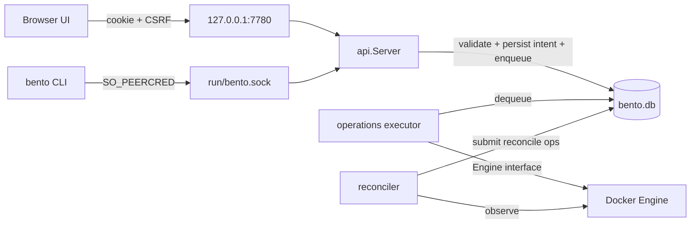

# Backend architecture

This document explains how the Go backend is put together and why.

## Processes and listeners

`bento serve --stack ROOT` is the only long-running Bento process for a stack. On start it:

1. refuses a root without `bento.db` (lost state fails closed; it never initializes) or one that is not a Bento stack;
2. takes `locks/controller.lock` (`flock`, held until exit) — offline `init`/`import` take the same lock, so one
   process owns a stack at a time;
3. opens the store (refuses foreign/old/future schema) and connects to Docker (a Docker outage is logged, not fatal);
4. marks operations left `running` by a previous process as `interrupted` (`Controller.Recover`);
5. starts the operation executor, the reconciler, the scheduler loop (`Controller.RunSchedules`), and the relay reaper;
6. serves the same HTTP handler on two listeners:
   - TCP on a **loopback-only** address (`cli.ValidateListen` rejects anything else) for the browser;
   - `run/bento.sock` (`0600`) for the CLI, wrapped by `Server.LocalOnly`, which admits only peers whose
     `SO_PEERCRED` uid is 0 or the backend's own uid.
   - **utils** TCP listeners (`--utils-listen`, default `127.0.0.1:7781` and `apps:7781`) serving
     `Server.UtilsHandler` only: self-authenticating routes under `/_bento/webhook/*`, and the ticketed database browser
     under `/_bento/dbadmin/*`, and nothing else (no UI, operator login, or management API). `apps:PORT` binds the host's address on the apps bridge (`NetworkSettings.AppsGateway`,
     read from the host's interfaces because Docker picks it, usually `.128`) once the bridge exists and follows the
     network plan, so the edge and cloudflared
     can reach it; the loopback address is for host proxies. Operators may bind any address because nothing on
     this listener works without a credential; `off` disables it.

On SIGTERM it stops both listeners, waits up to 60 s for the current operation, stops relays, and exits. Containers
are never stopped on shutdown.



## Package dependency direction

```text
cmd/bento → cli → api → operations → {runtime, dataservices, edge, backup, transfer, scheduler} → docker, store, domain, platform
                 → stack (init/import)
                 → reconcile → operations
```

`domain` has no I/O. `store` knows SQLite and `domain` only. `docker` is the only package importing the moby client;
everything else goes through the `docker.Engine` interface (tests use `docker.Fake`). `api/dto` imports nothing from
the rest of the backend, so the generated TypeScript never leaks persistence or SDK types.

## State: `store`

One SQLite file (`bento.db`, `0600`) opened with `modernc.org/sqlite` (pure Go), WAL, `foreign_keys`, a single
connection, and `BEGIN IMMEDIATE` transactions.

- **Versioning:** `PRAGMA application_id = 0x424E5431` marks a Bento Go database, `PRAGMA user_version` is the schema
  version (currently 2). `store.CheckCompatible` probes with `mode=ro&immutable=1`, so refusing a foreign, older,
  newer, or non-SQLite file writes nothing (not even `-wal`/`-shm`). There are no migrations yet; a future version adds
  them and bumps `SchemaVersion`.
- **Tables:** `meta` (stack id/name, uid high-water mark), `settings` (JSON: uid range, edge, tunnel,
  network plan, operator password hash), `schedules`, `uid_ledger`, `apps`, `domains` (one owner per name, one primary per owner),
  `proxies`, `data_services`, `bindings` + `binding_databases` (add-only), `retired_apps`, `operations` +
  `operation_events` (≤200 events each), `sessions`, `images`, `backup_runs`.
- **Rule:** repositories take a `store.Q` so they work inside or outside a transaction. Never hold a transaction
  across a Docker call.

### Identity allocation

`store.AllocateUID` runs inside the create transaction: next candidate = max(high-water mark, max ledger uid) + 1,
skipping host passwd/group collisions (`platform.FileHostIDs`), inserting a ledger row (`allocated`) and advancing the
high-water mark. Ledger rows are never deleted: provisioning success → `active`; removal → `retired` (or `burned` if
never provisioned). UID == GID. A rolled-back transaction frees nothing permanently because nothing was committed.

## Operations: `operations`

Every change with external effects follows the same path.

1. **Acceptance** (`accept.go`, called by API handlers): validate input, check preconditions and exact
   confirmations, then `Controller.Submit`, which in **one transaction** runs the `Mutate` callback (persist intent,
   e.g. `desired_runtime='stopped'`) and inserts the operation row. With an `Idempotency-Key`, an existing operation
   with that key is returned instead (a different kind/target with the same key is a conflict).
2. **Execution** (`controller.go`): one dispatcher goroutine scans the `queued` operations oldest first, marks each
   one it can start `running`, and runs the handler registered for its kind (`registerHandlers` in `apps.go`) in its
   own worker, up to `bento serve --op-concurrency` (default 4) at once. Handlers call `r.Phase(ctx, name)`
   between effects; that records the phase/event and is the **only** place a requested cancellation is honored.
3. **Completion:** the handler returns a result (stored as JSON) or an error. `*OpError` carries a stable code and
   operator guidance; other errors become `failed` with generic guidance. A panic is caught and recorded.

Parallelism is deliberately conservative. Each operation declares **claims** (`claims.go`): exclusive on its own app
or service, shared on the data services an app is bound to, or global. The dispatcher starts an operation only when its
claims do not conflict with any running operation or with any *earlier queued operation that has not started*, so
operations on the same resource keep FIFO order and nothing overtakes a waiting exclusive or global operation.

| Kind | Claims |
| --- | --- |
| `app.reconcile`, `app.start`, `app.restart`, `app.update`, `app.deploy` | exclusive `app:<id>`, shared `service:<name>` for each bound service (and `redis`) |
| `app.stop` | exclusive `app:<id>` |
| `service.create`, `service.reconcile` | exclusive `service:<name>` |
| `image.prepare` | exclusive `image:<key>`, in the `image-build` pool (at most `runtime.MaxConcurrentBuilds` = 2 at once) |
| everything else, and any unclassified kind | **global**: runs alone, after everything before it, before anything after it |

An `app.start` or `app.update` of an unprovisioned app is global because provisioning writes grants on shared data
services. The reasons for each global kind are the shared state it rewrites: the edge settings or several routes at once
(`edge.apply`, `app.publish|unpublish|remove`), data services and their grants (`app.provision`, `binding.add`,
`database.add`), removing from the image set (`image.prune`), home ownership (`app.permissions`), or every app at once
(`stack.export`, `backup.*`).

A dispatch pass loads every app once (for the claims of app operations) and records, for each queued operation that is
blocked, the operation it waits behind. The API returns it as `waitingOn` on queued operations; the UI shows it on the
Activity page and in the operation tracker, and `bento ops` in the PHASE column. An operation that is only waiting for
a free slot has no `waitingOn`.

Parallel handlers share five things, each serialized inside the handlers:

- **Edge generations, container and reload** — `edgeMu` around `applyEdge`. It renders the whole route set, so two
  parallel applies would race on `edge/conf/{live,previous}`.
- **Network plan and creation** — `netMu` in `NetworkPlan`/`EnsureNetworks` (read-then-write of the plan setting and
  check-then-create of the Docker networks).
- **Runtime image builds** — `ImageManager` locks per image tag: concurrent `Ensure` calls for one tag build it once;
  different tags (for example a PHP and a Node image) build concurrently, at most `MaxConcurrentBuilds` (2) at a time
  from any operation. `Remove` (image prune) excludes every `Ensure`.
- **Redis ACL** — `aclMu` in `syncRedisACL`, which reads every app's identity, rewrites the ACL file and reloads Redis.
  `app.update` and `service.reconcile` of Redis may call it in parallel.
- **Route activation of a booting app** — while an operation is (re)starting an app's instance and has not seen it ready,
  the app is *warming* and every edge render treats it as not running, so another operation's `applyEdge` never routes
  to it early. If such an apply happened, the warming operation re-applies the edge as soon as the app is ready (a
  failure there is a warning; edge drift reconciliation retries). `EdgeConfigDrift` reports no drift while any app is
  warming, so the reconciler does not queue an `edge.apply` for a route that is about to be restored. The flag clears
  on readiness or when the operation ends.

Lock order when nested: image tag lock, `edgeMu`, `netMu`; `aclMu` and `runMu` (running, warming and waiting state) are
leaves.

Handlers re-read state from the store, so an operation that was superseded (e.g. `start` after a later `stop`) notices
and exits. `--op-concurrency 1` restores strictly serial execution; the maximum is 16. Shutdown stops dispatching and
waits for every running operation.

Operation kinds: `app.provision|start|stop|restart|update|publish|unpublish|remove|prune|reconcile|permissions`,
`binding.add`, `database.add`, `service.create|reconcile`, `edge.apply`, `tunnel.apply`, `backup.run|restore`,
`stack.export`.

### App lifecycle internals (`apps.go`)

- **provision:** `ensureHome` creates `homes/<slug>` (`0750`, app-owned), its `app/` code directory, and a root-owned
  `.bento-identity.json` sidecar, or verifies an existing home belongs to this incarnation (a foreign home is refused,
  never re-owned); creates SQLite dirs; provisions relational grants and Redis ACLs; materializes config; marks the
  app provisioned and the ledger row active. Idempotent.
- **ensureInstance:** verify durable state → ensure networks → `materialize` (resolve image, write config) → plan
  spec + fingerprint → observe. If an owned container exists with the same fingerprint, start it if needed; if the
  fingerprint differs, stop it, remove it, then create/start the replacement (never two instances at once). Duplicates
  or foreign containers on the name block the operation.
- **waitReady:** polls `checkReady` until `ReadyTimeout` (180 s): container running with the intended generation,
  `bento-ready` exec succeeds inside the container (scheduler socket, FPM ping, local HTTP), and a direct HTTP GET from
  the backend to the container's apps-network IP returns < 500. An exited container fails fast with a log tail.
- **update:** if the boot fingerprint changed, replace; otherwise run `scopedReloads` for whichever of
  frontend/pool/scheduler files changed: validate with the running process (`nginx -t`, `php-fpm -t`,
  `minicrond validate`); on failure restore the previous bytes (`runtime.Changes.Restore`) and send nothing; on
  success reload (`nginx -s reload`, `s6-svc -r`, `minicrond reload`).
- **stop:** remove the edge route first, then set the restart policy to `no` and stop. If the edge apply fails the
  stop still proceeds with a warning; the stale route returns 502 until edge drift reconciliation reapplies it. The persisted intent plus
  `restart=no` is what keeps a stopped app stopped across backend and host restarts.
- **remove:** route removal (an edge apply failure is a warning, not a blocker, as for stop), container removal (owned only), verify nothing remains, record a `retired_apps` row
  listing retained artifacts, retire the UID, delete app rows, delete generated config, refresh Redis ACLs.
- **prune:** drop the recorded relational databases and user, delete SQLite dirs and the home (only if its sidecar
  still names the retired app id). UIDs are never reclaimed.

## Reconciliation: `reconcile`

`Reconciler.Run` watches Docker events filtered to this stack's labels (hints only; a reconnect triggers a resync),
debounces triggers for 2 s, and also runs a full `Pass` every 60 s. A pass:

- skips any target with a queued/running operation;
- for initialized data services, submits `service.reconcile` if the container is not running;
- for provisioned apps: desired `stopped` but running → submit `app.reconcile`; desired `running` but missing, not
  running, or with a different planned fingerprint (`Controller.PlannedGeneration`, computed without writing files)
  → submit `app.reconcile`. Health alone never triggers action;
- for a running app whose planned runtime image is not built (a changed image template or pinned artifact, such as a
  minicrond bump) → submit one `image.prepare` per runtime key instead, and leave the instance serving on its current
  image. The app is reconciled (replaced) only on a pass after the build has succeeded; the reconciler watches its
  pending prepares and triggers that pass as soon as one finishes. A failed build keeps the old instance and backs off
  under the `image:<key>` target. Apps that are missing or stopped build inline in `app.reconcile`, since nothing is
  serving;
- ensures the edge and tunnel exist when enabled;
- removes exited tool containers owned by the stack.

Each target has a retry budget: failures back off from 30 s doubling to 30 min; after 5 failures the target is
**blocked** until its config generation changes or an operator lifecycle action calls `ResetBudget`. Status is exposed
in app DTOs (`reconcile`, and `observed.state = blocked`).

Recovery of missing durable data is refused by the handlers themselves (`verifyHome`, `ensureService` with
`allowInit=false`), not by the reconciler, so the same rule applies to manual operations.

## Runtime planning: `runtime`

### Names and labels

`runtime.Names` derives every Docker name from the stack name: `bento-<stack>-app-<appId>`, `-tool-<appId>-<op>`,
`-edge`, `-cloudflared`, `-<service>`, `-job-<op>`, volumes `bento-<stack>-<service>-data`, networks
`bento-<stack>-apps` / `-data`, and the routing alias `app-<appId>`. Labels: `io.bento.managed`, `stack-id`,
`app-id`, `role` (`runtime|tool|edge|database|cache|tunnel|backup|network|volume`), `generation`, `operation-id`,
`service`, `image-key`. `Names.OwnedBy` is checked before any stop/remove; names alone never authorize anything.

### Generated app configuration

`RenderAppConfig` produces, in memory:

| File (`apps/<appId>/config/`, mounted at `/etc/bento`, `0440 root:<gid>`) | Reload scope |
| --- | --- |
| `runtime.env` — non-secret metadata (`BENTO_APP_ID`, `BENTO_HTTP_PORT`, `BENTO_TRUSTED_PROXIES`, …) | boot |
| `credentials.env` — `DB_*`, `BENTO_DB_<n>_*`, `REDIS_*` | boot (via credentials generation) |
| `app.argv` — NUL-separated argv (HTTP apps) | boot |
| `nginx.conf`, `fastcgi.conf` (PHP) | frontend reload |
| `php-fpm.conf`, `php.d/zz-app.ini` (PHP; the ini is on the image's `PHP_INI_SCAN_DIR`) | pool restart |
| `minicrond.toml` — config-owned `zz-bento-*` tasks | scheduler reload |

plus `apps/<appId>/identity/{passwd,group}`: the image's own files (read once per image ID via a created-not-started
container and cached) with the app user appended. They are mounted as single files and are boot-static.

The whole directory is mounted (not individual files) so atomic renames inside it are visible to running processes.

### Container spec and fingerprint

`AppContainerSpec` sets: `User uid:gid`, read-only root, `CapDrop: ALL`, `no-new-privileges`, tmpfs `/run`
(uid-owned, **exec**, 64 MiB — s6-overlay needs to execute from it) and `/tmp`, Engine-API memory/CPU/PID limits,
`local` log driver (10 MB × 3), health check running `bento-ready`, restart `unless-stopped` (or `no`), working
directory `/home/<slug>/app`, and endpoints on both stack networks. Mounts: own home, config dir, identity files, own
SQLite dirs. Nothing else.

`Fingerprint` hashes every boot-static, **non-secret** input (image ID, user, env, mounts, tmpfs, resources, networks,
hashes of `runtime.env`/argv/identity files, the credentials generation counter, and `specVersion`) into the
`io.bento.generation` label. Secret values never enter it; a credential change bumps `CredentialsGeneration` instead.
Bump `specVersion` whenever you change the shape of the spec so existing containers are replaced deliberately.

`ToolContainerSpec` uses the same image and mounts with entrypoint `bento-exec`, Docker's init, restart `no`, and an
idle `sleep` command; it never runs `/init`, starts no daemons, and does not take the instance lock.

### Managed images

`PlanImage` combines the embedded context for `php` or `http` (`templates/images/common` overlaid with the kind) with
pinned build args (base image, s6-overlay and minicrond versions and SHA-256s, Composer) and hashes both into the tag
`bento-runtime/<toolchain>:<version>-<hash12>`. `ImageManager.Ensure` builds only when that tag is missing, using the
Engine API classic builder (`build.BuilderV1`) — no BuildKit features in the Dockerfiles. Tar headers use fixed modes
and mtimes so the context is byte-reproducible.

### Inside a runtime container

`bento-init` (entrypoint) refuses root, takes an exclusive `flock` on `$HOME/.local/state/bento/instance.lock`
(exit 75 if held) and `exec`s s6-overlay's `/init`, which inherits the lock fd. s6 services (`user-bundles.d`):

- PHP image: `nginx` (local frontend on :8080, internal FPM ping on 127.0.0.1:8081), `php-fpm` (single app pool),
  `minicrond`;
- HTTP image: `app` (argv from `/etc/bento/app.argv`, `PORT`/`HOST` exported), `minicrond`.

Every run script sources `env.bash`, which loads `runtime.env` and `credentials.env` key-by-key without shell
evaluation. `bento-finish` applies bounded backoff and halts the container after 5 failures of a service within
120 s, handing restart backoff to Docker.

## Networking and ingress

`Controller.EnsureNetworks` persists a network plan (two free `/24`s from `10.200.0.0/13`): the **apps** network
(egress allowed; dynamic addresses restricted to the upper `/25`; `.2` reserved for the edge, `.3` for cloudflared) and
the **data** network (`internal: true`). Apps and tools join both; the edge and tunnel join apps only; data services
join data only. Those two reserved addresses are the only `set_real_ip_from` sources in app Nginx and the value of
`BENTO_TRUSTED_PROXIES`.

The edge (`edge` package + `operations/edge.go`):

1. `edge.Render` builds the full file set from current intent: only `managed` + `published` apps and enabled proxies.
   App upstreams use `set $bento_upstream http://app-<id>:<port>; proxy_pass $bento_upstream;` with
   `resolver 127.0.0.11 valid=10s`, so a replaced container is re-resolved without a reload. Forwarding headers are
   overwritten, not appended.
2. If the output differs from `edge/conf/live`, it is staged in `edge/conf/candidate-*`, validated with `nginx -t`
   inside the running edge (or a throwaway validator container), and swapped with `live` using
   `renameat2(RENAME_EXCHANGE)`; the old generation is kept as `previous`.
3. The edge container is recreated only when its own settings fingerprint changes (ports, bind, HTTP/3, image);
   otherwise it gets `SIGHUP`. Includes in the generated config are relative, which is why candidates validate in place.

Publication is persisted only after `checkReady` passes, and route activation is the last step of start/publish.

When the utils listener binds the apps network, every managed route (app or proxy) reserves
`location ^~ /_bento/webhook/`, proxied through the shared `bento_utils` upstream (`<apps-gateway>:<port>`,
`keepalive 2`) with an 8 MiB body limit; it never reaches the
upstream. Without an apps-network listener the path is left to the upstream. Other ingress (host nginx, a Cloudflare
Tunnel path rule, an operator proxy) forwards `/_bento/webhook/*` to a utils listener itself. `/_bento/dbadmin/*` is never reserved on app routes.

### Git deploy and webhooks

`app.deploy` runs in a tooling container as the app identity: fetch (deploy key on stdin, `/tmp` only), then
`~/deploy.sh` when present in a **separate** exec (so the key is gone), then record the commit, then reload the app
process. `~/deploy.sh` must be a regular executable file owned by the app or root; anything else fails
`deploy-script-invalid` before any exec. It runs from `app/` with the app environment plus `BENTO_DEPLOY_TRIGGER`,
`BENTO_OPERATION_ID`, `BENTO_REPO_URL`, `BENTO_BRANCH`, `BENTO_COMMIT`, `BENTO_PREVIOUS_COMMIT` (last fully successful
deploy), and for webhooks `BENTO_WEBHOOK_{PROVIDER,EVENT,DELIVERY,REF,COMMIT,PUSHER}` (sanitized). A failing or
timed-out script leaves the new code checked out but does not record the deploy or reload the app.

A webhook (`settings` key `webhook:<appId>`) has a routing-only `hookId` and a 256-bit secret, returned only by the
enable/rotate response. `Controller.HandleWebhook` verifies `X-Hub-Signature-256` / `X-Gitea-Signature` /
`X-Forgejo-Signature` / Bitbucket `X-Hub-Signature` (HMAC-SHA256 over the raw body), `X-Gitlab-Token`, or
`Authorization: Bearer`; an unknown hook and a bad credential both return 404 and are not recorded. Only a push to the
configured branch deploys, and the payload never chooses what is fetched. A queued deploy absorbs further pushes
(`coalesced`); a provider delivery id is the idempotency key (`duplicate`). The last 20 authenticated deliveries are
kept with their result, the verifying credential, and the pusher. The `utils` setting's `baseUrl` (pure display
intent, `PUT /api/v1/utils`) builds full webhook URLs and database browser links; without it the app's primary domain is used when the edge
forwards webhooks. Removing the git source or the app destroys the webhook.

## Data services and backups

`dataservices.Manager` creates each service's secrets once (`services/<name>/secrets`, `0400`; MySQL gets a
`client.cnf`), runs containers on the data network with their named volume, and treats a service as ready only when it
answers over **TCP** (first-boot entrypoints run a socket-only temporary server). Administrative SQL is sent on exec
stdin; identifiers are validated against `^[a-z][a-z0-9_]{0,62}$`. Provisioning refuses an existing database that the
binding's user does not already own. Redis runs with a generated `users.acl` containing only SHA-256 password hashes and
per-app `~<slug>:*` key patterns, reloaded with `ACL LOAD`.

`ensureService(allowInit)` creates a volume only for a never-initialized service; for an initialized service a missing
volume is a `volume-missing` failure. Volumes are never removed (except volumes a failing `import` created itself).

`backup` streams `mysqldump`/`pg_dump` exec output through zstd/gzip into a `0600` partial, fsyncs, and renames only a
non-empty result. SQLite uses `.backup` in a network-less job container that mounts only that binding directory and a
private staging dir. The batch holds `locks/backup.lock`; retention runs only after the whole batch succeeds; rclone runs
in a job container of the pinned image with the `rclone/` directory (writable, so OAuth token refreshes persist) and the
new artifacts (read-only). Before any rclone container runs, `backup.checkRemote` requires `rclone.conf` to be a
regular, unencrypted file that defines the remote; the API only ever reads section names and `type`. The rclone shell
(`GET /backups/rclone/terminal`) is the same terminal machinery as app shells (`serveTerminal`, keyed by scope) over an
idle `sleep` container of that image that mounts only `rclone/`; `backup.rclone-test` runs `rclone lsf --max-depth 1`
and treats exit 3 (directory not found) as reachable. The stack-wide backup settings are the `backup-default` row of
`schedules` (kind `backup`; spec: compression, retain, rclone remote); a backup request's `scheduleId` selects whose
retention and remote apply.

## Scheduler: `operations/schedules.go`

Platform jobs are rows in `schedules` (`id`, `kind`, `cron`, `enabled`, `spec_json`, bookkeeping). App jobs are not:
they run in each app's own minicrond as the app UID. `Controller.RunSchedules` ticks every 30 seconds, evaluates
enabled rows in the server's local time zone (`last_slot` is stored in UTC and converted back before `cron.Next`), and
for a due slot calls the kind's `Submit`, which only queues a durable operation. Rules:

- Slots missed by more than 10 minutes are counted as missed and skipped, unless the kind sets `CatchUp` (run once).
- A slot is skipped (`last_state=skipped`) while the schedule's previous operation (`last_op_id`) is not terminal.
- Bookkeeping is saved only if `revision` is unchanged, so a concurrent edit (which resets `last_slot` to now) wins.
- Unknown kinds are left untouched. Import disables every schedule and clears its bookkeeping.

To add a kind: register it in `scheduleKinds`, validate its spec where it is edited, and submit an existing or new
operation kind (with its claims) from `Submit`.

## Transfer

`stack.export` stops running apps and services, takes `VACUUM INTO state.db`, archives the root (excluding the live DB,
`run`, `locks`, `cache`, `staging`, `backups`; sockets skipped) as zstd tar with numeric ownership, archives each
volume with a `tar` job container, writes `manifest.json`, makes everything `0600`, and restarts exactly what it
stopped. `stack.Import` validates the manifest (format, version, schema, safe file names, architecture), extracts with
`transfer.ExtractRoot` (relative clean names only, symlinks relative and contained, no writes through symlinks, no
device nodes, `O_EXCL`), assigns a new stack id, forces apps stopped/unpublished, cancels queued/running operations,
disables edge/tunnel/schedule, drops the network plan, re-stamps home sidecars, restores volumes, and on failure removes
only what it created.

## API surface: `api`

- `http.go`: strict decoding (`application/json`, 1 MiB, `DisallowUnknownFields`, no trailing data), error mapping to
  stable `dto.ErrorCode`s, `Idempotency-Key` format, path id validation.
- `auth.go`: argon2id password (`settings.auth`), 12-hour sessions stored as SHA-256 token hashes, `HttpOnly`
  `SameSite=Strict` cookie, login rate limit (10 failures / 5 min), and for writes: exact `Origin` in
  `AllowedOrigins`, `Sec-Fetch-Site: same-origin` when present, and `X-CSRF-Token` equal to the session's token.
  Changing the password revokes every session.
- `server.go`: routes and resource handlers; mutations respond `202` with the operation and `Location`.
- `stream.go`: logs as SSE (tail ≤ 5000, 30 min, 20 MB, the app's secrets redacted, resume via `since`/`Last-Event-ID`),
  operation events as SSE, bounded exec (1 MiB, 10 min), `minicrond` passthrough (refuses `daemon`), and the
  WebSocket terminal (origin + CSRF query token for browsers; binary frames for bytes, JSON text frames for
  `resize`/`exit`; 30 min idle, 4 h max). Log lines over 256 KiB are truncated with a `…[truncated]` marker and the
  stream continues. Exec and `minicrond` output get the same secret redaction as logs. The interactive terminal PTY
  stream is deliberately **not** redacted: a secret can be split across arbitrary chunk boundaries and terminal escape
  sequences, and the operator can already read the app's secrets from its environment inside that shell, so
  redaction there would give false assurance.
- `gateway.go`: the scheduler UI gateway (see below). The management handler serves no app-controlled content.
- SPA serving: existing files are served; client routes fall back to `index.html`; asset-like paths 404.

## Database browser: `api/dbadmin.go`, `operations/dbadmin.go`

`dbadmin.apply` (setting `dbadmin`, `PUT /api/v1/dbadmin`) runs one pinned `adminer` container
(`bento-<stack>-dbadmin`, role `dbadmin`) on the data network only: user `100:101`, read-only root, no capabilities,
`/tmp` tmpfs, and one read-only mount of `<root>/dbadmin` (`0750 root:101`) holding `router.php` (embedded from
`templates/dbadmin`) and a generated `gateway-token` (`0440`). The generation label hashes the router, image, and a
version; the reconciler recreates a missing, stopped, or outdated container while enabled.

`POST /api/v1/apps/{id}/bindings/{bid}/dbadmin` (browser session only) issues a one-minute single-use ticket held in
memory by token hash. `GET /_bento/dbadmin/t/<ticket>` on the utils listener redeems it for a grant cookie
(`bento_dbadmin`, HttpOnly, SameSite=Lax, path `/_bento/dbadmin/b/<bid>/`, 30 minutes idle) and redirects. Each
`/_bento/dbadmin/b/<bid>/…` request checks the grant, `GetLiveSession` for the issuing session, same-origin fetch metadata
on writes, the setting, and the binding; then it proxies to the container's data-network address (the host reaches
the bridge), forwarding only `adminer_*` cookies and adding `X-Bento-*` headers (driver, service host, user,
base64 password, databases, gateway token). `router.php` checks the token, forces those values into Adminer on every
request, and keeps only a placeholder password in Adminer's session. Response cookies are re-scoped to the binding
path. Tickets and grants do not survive a backend restart.

## Scheduler UI gateway: `api/gateway.go`

minicrond's UI is served on the management origin at `runtime.SchedulerBasePath` = `/apps/<slug>/scheduler`
(`BENTO_SCHEDULER_BASE_PATH`); the bare path without a trailing slash stays a client route of the web UI, and
`/apps/{slug}/scheduler/` is the proxy. minicrond escapes its own UI and sends a strict CSP with no framing; the gateway
adds what only it can enforce. Each request needs a live operator session cookie (a missing session is a plain-text
401), the slug must be an app's slug (not its id) that is desired running, and writes need an exact allowed `Origin`
plus same-origin fetch metadata. The CSRF token is deliberately not required: minicrond's UI is app-served and is never
given it. Cookie, authorization, CSRF, and forwarding headers are stripped before the request crosses the relay;
`Set-Cookie` and duplicate `X-Frame-Options`, `X-Content-Type-Options`, and `Referrer-Policy` headers are dropped, and
responses get `Cache-Control: no-store` and `Cross-Origin-Resource-Policy: same-origin`. minicrond's own
`Content-Security-Policy` is kept next to the management one, so the browser applies the intersection. It is not
framed. Streaming uses `FlushInterval: -1`; bodies are capped at 10 MB. **Trust boundary:** the app owns its minicrond
socket directory, so a compromised app can put its own server behind the relay, and that content then runs on the
management origin and can read the session's CSRF token from `GET /api/v1/session`. The CSP (`script-src 'self'`) does
not prevent that; the scheduler is only as trustworthy as the app's UID.

## Scheduler relay: `scheduler`

minicrond authorizes Unix-socket callers by peer UID. For each app, `RelayManager.start` (root):

1. validates `homes/<slug>/.local/share/minicron/minicron.sock` (no symlinks below the home, a socket, owned by the
   app UID);
2. listens on `run/relay/<appId>.sock` (`0600`, root-only directory);
3. opens the socket's directory with `O_DIRECTORY|O_NOFOLLOW`;
4. starts `/proc/self/exe internal-relay` with `Credential{Uid, Gid, Groups: []}`, `Pdeathsig`, and the listener
   (fd 3) and directory (fd 4) as inherited descriptors.

The child refuses to run as root, `fchdir`s to fd 4 (so it needs no traversal rights above the app-owned directory and
avoids `sun_path` limits), re-checks the socket's owner on every connection, and splices bytes. The backend never
changes its own UID and never execs into containers per request. Relays idle for 10 minutes are stopped.

## Security invariants (checklist for reviewers)

- No secret in argv, labels, the fingerprint, logs, API responses, or container env; secrets travel via exec stdin,
  `0400/0440` files, or hashed ACLs.
- App containers: numeric app UID/GID, read-only, no capabilities, `no-new-privileges`, no host ports, no Docker
  socket, only their own home/SQLite/config mounted.
- Destructive actions check labels, role, and (for app containers) the home mount first.
- Exact confirmations are enforced server-side in `accept.go`, not only in the CLI/UI.
- Missing durable data blocks; nothing is ever silently re-created empty.
- The management API is loopback-only and requires a session or a peer-verified local socket.
- The utils listener serves only routes that authenticate themselves: deploy webhooks (per-app secret; can at most
  queue a deploy of the configured branch) and the database browser (single-use ticket from a session + CSRF call,
  then a binding-scoped grant re-checked against the live session on every request), and the scheduler UI (the same
  ticket/grant scheme, scoped to one app slug). Never add Bento's own UI, login, or management routes to it.
- App-controlled content (the scheduler UI) is never served on the management origin; the management UI sets
  `frame-src 'self'` and `frame-ancestors 'none'` (only the scheduler gateway relaxes the latter to `'self'`, so the
  Scheduler tab can embed it; the app runs with `MINICRON_ALLOW_IFRAME=1`), and `Origin: null` never passes the origin check.
- The Adminer container holds no credentials, joins only the data network, and refuses requests without the
  gateway token. The gateway injects one binding's app-user credentials per request; URL parameters cannot select
  another server, driver, user, or database.
